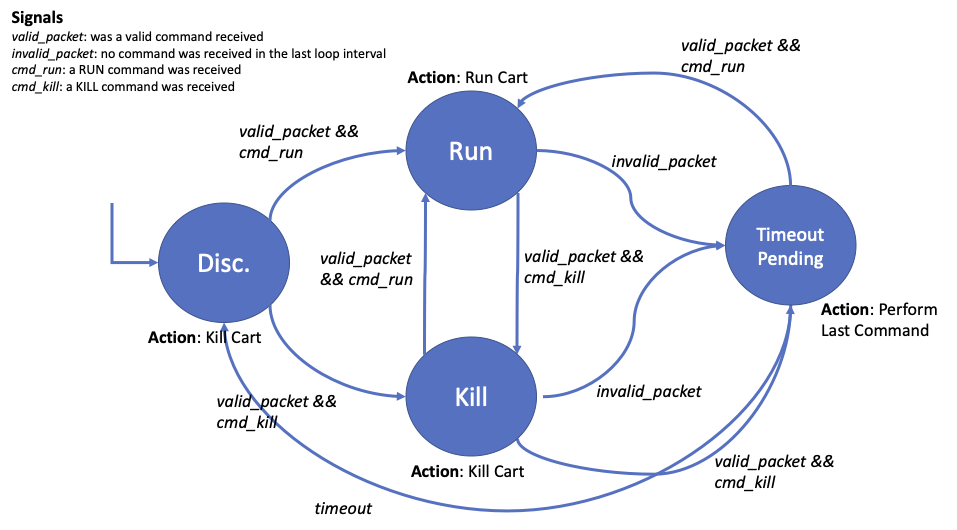

Sub-folder for Remote Kill Switch Implementation.

System is two boards connected via Xbee radios. User (Itsy 32u4 @ 3V) and Cart (Arduino UNO @ 5V).

User radio will constantly transmit ASCII character '1' or '0' to indicate whether the JACart should RUN or KILL. '1' indicates RUN and '0' indicates KILL.

Network parameters are:

PAN ID:

Channel:

User Radio MY_ID:

Cart Radio MY_ID:

TODO:
- Current logic is overly complex. Delete the TIMEOUT state and valid/invalid packet signals. Add timeout login into both RUN and KILL states.